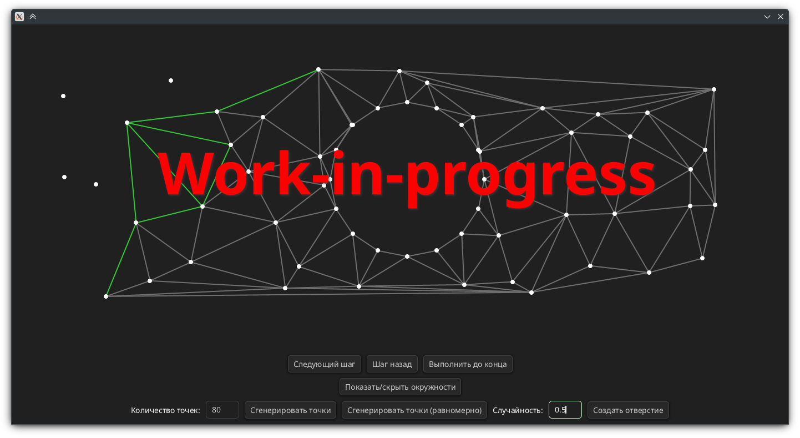

# Toscel

a work-in-progress component library for sigui



```nim
import sigui, toscel

let win = newUiWindow(title="Toscel example")

win.makeLayout:
  this.clearColor = "202020".color

  - Layout.row:
    this.centerIn parent
    gap = 10

    - Button.new:
      text = "Button"

    - LineEdit.new:
      text = "LineEdit"

run win
```

